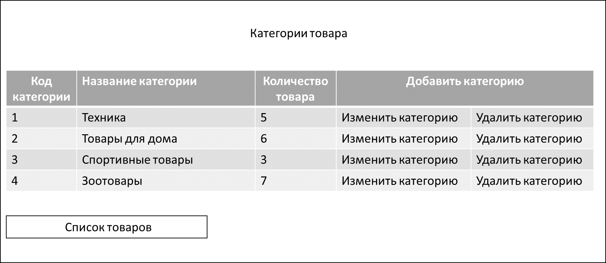
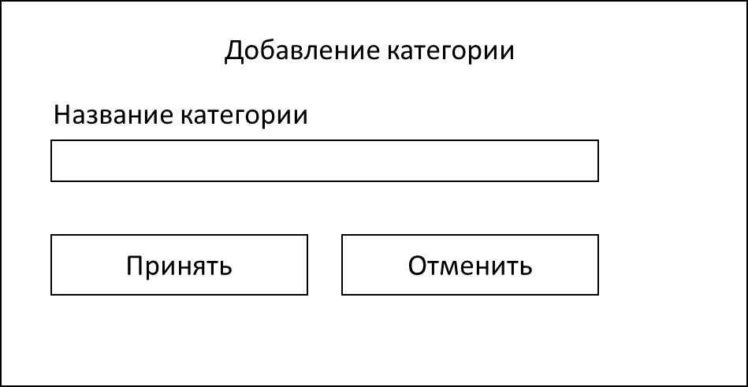
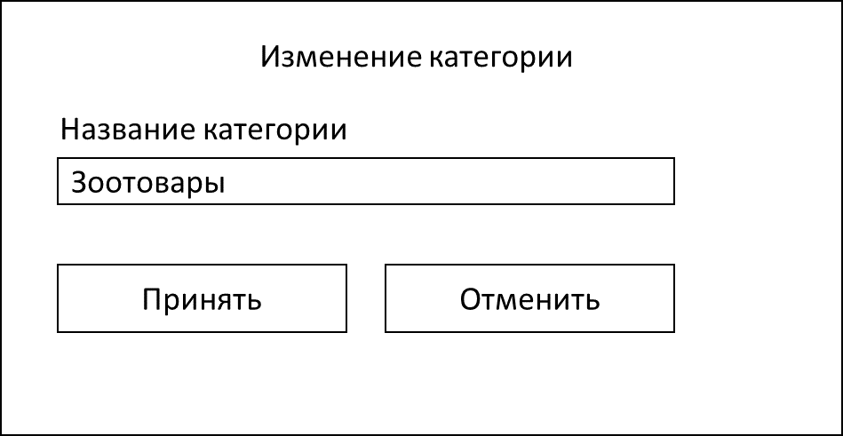
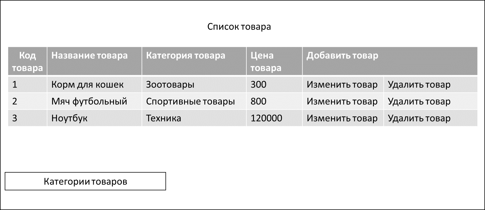
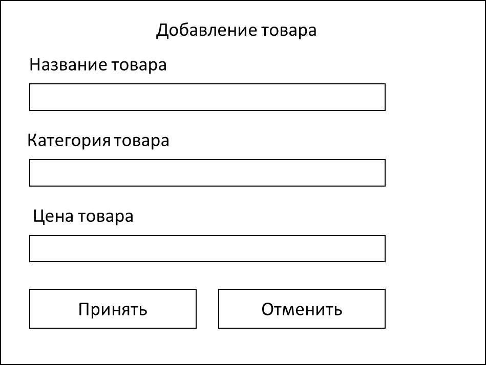
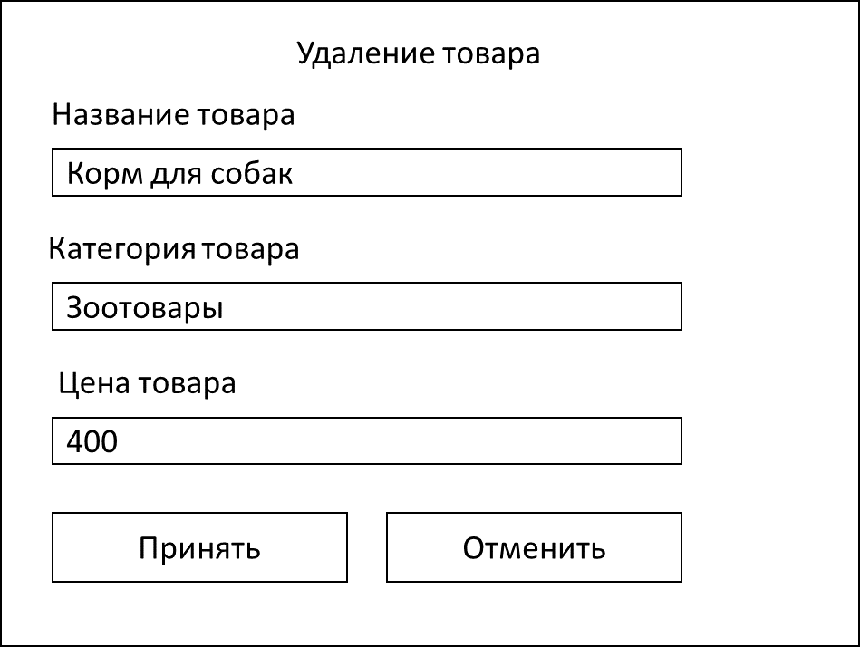

Функциональная спецификация программы *«Категории-товары»*

**Видение**

Требуется создать рабочий прототип Web приложения для работы с категориями «Категории товара», «Список товара».

Приложение должно реализовывать следующие функции:

- Просмотр и редактирование списков «Категории товара», «Список товара»;
- Отображение количества позиций товаров в каждой из категорий;

1. **Просмотр списка категорий товара.**

*Основной сценарий:*

Отображается форма просмотра категорий товара.

Рисунок 1.1 – форма «Категории товара»

В форме отображается таблица с колонками:

- Код категории;
- Название категории;
- Количество товара;
- Добавить категорию (в поле находится кнопка «Добавить категорию», в полях столбца для каждой категории находятся
  кнопки «Изменить категорию», «Удалить категорию»).

Для перехода к форме «Список товара» используется кнопка «Список товара».

1. **Добавление категории**

Рисунок 1.2 – Добавление категории

При добавлении категории вводятся следующие реквизиты:

- Название категории.

*Основной сценарий:*

- пользователь, находясь в режиме просмотра списка «Категории товара», нажимает кнопку «Добавить категорию»;
- отображается форма добавления категории;
- пользователь вводит данные и нажимает кнопку «Принять»;
- если данные введены не корректно, то отображается предупреждение о некорректных данных;
- если данные корректны, то категория добавляется в базу данных;
- если категория успешно добавлена, то открывается форма просмотра списка «Категории товара» с обновленными данными;
- Если произошла ошибка добавления данных, то выводится сообщение об ошибке: «Ошибка добавления данных».

*Сценарий отмены изменений:*

- пользователь, находясь в режиме просмотра списка «Категории товара», нажимает кнопку «Добавить категорию»;
- отображается форма добавления категории;
- пользователь вводит данные и нажимает кнопку «Отменить»;
- данные не сохраняются в базу данных, открывается форма просмотра списка «Категории товара».

1. **Редактирование категории**

Рисунок 1.3 – Изменение категории

При изменении категории редактируются следующие реквизиты:

- Название категории.

*Основной сценарий:*

- пользователь, находясь в режиме просмотра списка «Категории товара», нажимает кнопку «Изменить категорию»;
- отображается форма редактирования категории;
- пользователь изменяет данные и нажимает кнопку «Принять»;
- если данные введены не корректно, то отображается предупреждение о некорректных данных;
- если данные корректны, то категория обновляется в базе данных;
- если категория успешно изменена, то открывается форма просмотра списка «Категории товара» с обновленными данными;
- Если произошла ошибка добавления данных, то выводится сообщение об ошибке: «Ошибка изменения данных».

*Сценарий отмены изменений:*

- пользователь, находясь в режиме просмотра списка «Категории товара», нажимает кнопку «Изменить категорию»;
- отображается форма изменения категории;
- пользователь изменяет данные и нажимает кнопку «Отменить»;
- данные не сохраняются в базу данных, открывается форма просмотра списка «Категории товара».

1. **Удаление категории**

Рисунок 1.4 – Удаление категории

При удалении категории удаляются следующие реквизиты:

- Название категории.

*Основной сценарий:*

- пользователь, находясь в режиме просмотра списка «Категории товара», нажимает кнопку «Удалить категорию»;
- отображается форма удаления категории;
- пользователь и нажимает кнопку «Принять»;
- отображается диалог подтверждения на удаление: «Удалить категорию <наименование категории>?»;
- пользователь нажимает кнопку «Да»;
- происходит удаление категории из базы данных;
- если категория успешно удалена, то открывается форма просмотра списка «Категории товара» с обновленными данными;
- Если произошла ошибка добавления данных, то выводится сообщение об ошибке: «Ошибка удаления данных».

*Сценарий отмены изменений:*

- пользователь, находясь в режиме просмотра списка «Категории товара», нажимает кнопку «Удалить категорию»;
- отображается форма удаления категории;
- пользователь нажимает кнопку «Отменить»;
- данные не удаляются из базы данных, открывается форма просмотра списка «Категории товара».

Либо:

- пользователь, находясь в режиме просмотра списка «Категории товара» выбирает категорию и нажимает кнопку «Удалить
  категорию»;
- отображается форма удаления категории;
- пользователь нажимает кнопку «Принять»;
- отображается диалог подтверждения на удаление: «Удалить категорию <наименование категории>?»;
- пользователь нажимает кнопку «Нет»;
- данные не удаляются из базы данных, открывается форма просмотра списка «Категории товара».

1. **Просмотр списка товара.**

Рисунок 2.1 – форма «Список товара»

В форме отображается таблица с колонками:

- Код товара;
- Название товара;
- Цена товара;
- Добавить товар (в поле находится кнопка «Добавить товар», в полях столбца для каждой категории находятся кнопки
  «Изменить товар», «Удалить товар»).

Для перехода к форме «Категории товара» используется кнопка «Категории товара»

1. **Добавление товара**

Рисунок 2.2 – Добавление товара

При добавлении товара вводятся следующие реквизиты:

- Название товара;
- Категория товара;
- Цена товара.

*Основной сценарий:*

- пользователь, находясь в режиме просмотра списка «Категории товара», нажимает кнопку «Список товара»;
- пользователь, находясь в режиме просмотра списка «Список товара», нажимает кнопку «Добавить товар»;
- отображается форма добавления товара;
- пользователь вводит данные и нажимает кнопку «Принять»;
- если данные введены некорректно, то отображается предупреждение о некорректных данных;
- если данные корректны, то товар добавляется в базу данных;
- если товар успешно добавлен, то открывается форма просмотра списка «Список товара» с обновленными данными;
- Если произошла ошибка добавления данных, то выводится сообщение об ошибке: «Ошибка добавления данных».

*Сценарий отмены изменений:*

- пользователь, находясь в режиме просмотра списка «Список товара», нажимает кнопку «Добавить товар»;
- отображается форма добавления товара;
- пользователь вводит данные и нажимает кнопку «Отменить»;
- данные не сохраняются в базу данных, открывается форма просмотра списка «Список товара».
  1. Изменение товара

Рисунок 2.3 – Изменение товара

При изменении товара редактируются следующие реквизиты:

- Название товара;
- Категория товара;
- Цена товара.

*Основной сценарий:*

- пользователь, находясь в режиме просмотра списка «Категории товара», нажимает кнопку «Список товара»;
- пользователь, находясь в режиме просмотра списка «Список товара», нажимает кнопку «Изменить товар»;
- отображается форма изменения товара;
- пользователь изменяет данные и нажимает кнопку «Принять»;
- если данные изменены некорректно, то отображается предупреждение о некорректных данных;
- если данные корректны, то информация о товаре обновляется в базе данных;
- если товар успешно изменен, то открывается форма просмотра списка «Список товара» с обновленными данными;
- Если произошла ошибка добавления данных, то выводится сообщение об ошибке: «Ошибка изменения данных».

*Сценарий отмены изменений:*

- пользователь, находясь в режиме просмотра списка «Список товара», нажимает кнопку «Изменить товар»;
- отображается форма изменения товара;
- пользователь изменяет данные и нажимает кнопку «Отменить»;
- данные не сохраняются в базу данных, открывается форма просмотра списка «Список товара».

1. **Удаление товара**

Рисунок 2.4 – Удаление товара

При удалении товара редактируются следующие реквизиты:

- Название товара;
- Категория товара;
- Цена товара.

*Основной сценарий:*

- пользователь, находясь в режиме просмотра списка «Категории товара», нажимает кнопку «Список товара»;
- пользователь, находясь в режиме просмотра списка «Список товара», нажимает кнопку «Удалить товар»;
- отображается форма удаления товара;
- пользователь и нажимает кнопку «Принять»;
- отображается диалог подтверждения на удаление: «Удалить товар <наименование товара>?»;
- пользователь нажимает кнопку «Да»;
- происходит удаление товара из базы данных;
- если товар успешно удален, то открывается форма просмотра списка «Список товара» с обновленными данными;
- Если произошла ошибка удаления данных, то выводится сообщение об ошибке: «Ошибка удаления данных».

*Сценарий отмены изменений:*

- пользователь, находясь в режиме просмотра списка «Список товара», нажимает кнопку «Удалить товар»;
- отображается форма удаления товара;
- пользователь нажимает кнопку «Отменить»;
- данные не удаляются из базы данных, открывается форма просмотра списка «Категории товара».

Либо:

- пользователь, находясь в режиме просмотра списка «Список товара» выбирает категорию и нажимает кнопку «Удалить товар»;
- отображается форма удаления категории;
- пользователь нажимает кнопку «Принять»;
- отображается диалог подтверждения на удаление: «Удалить товар <наименование товара>?»;
- пользователь нажимает кнопку «Нет»;
- данные не удаляются из базы данных, открывается форма просмотра списка «Список товара».

